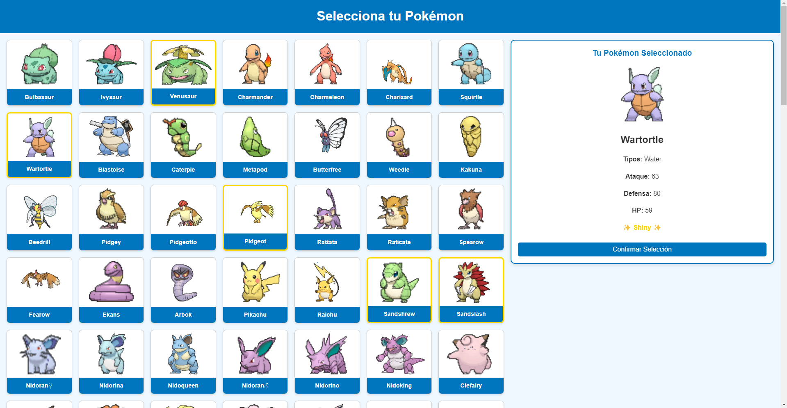
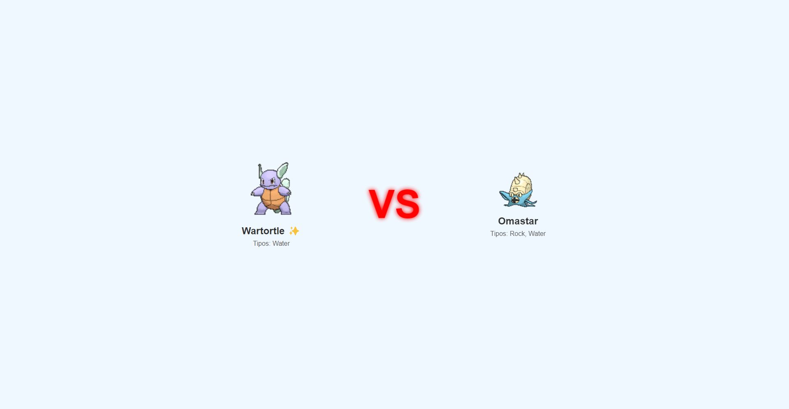
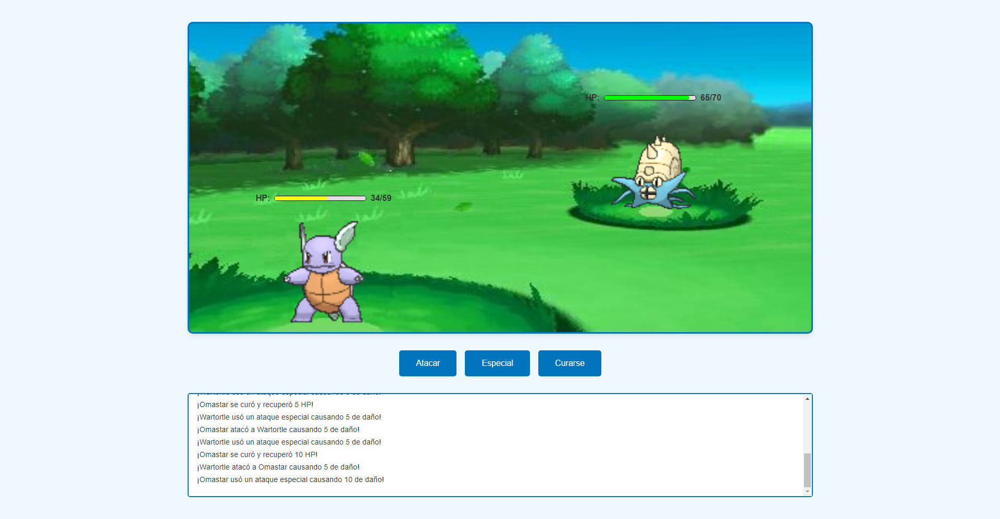
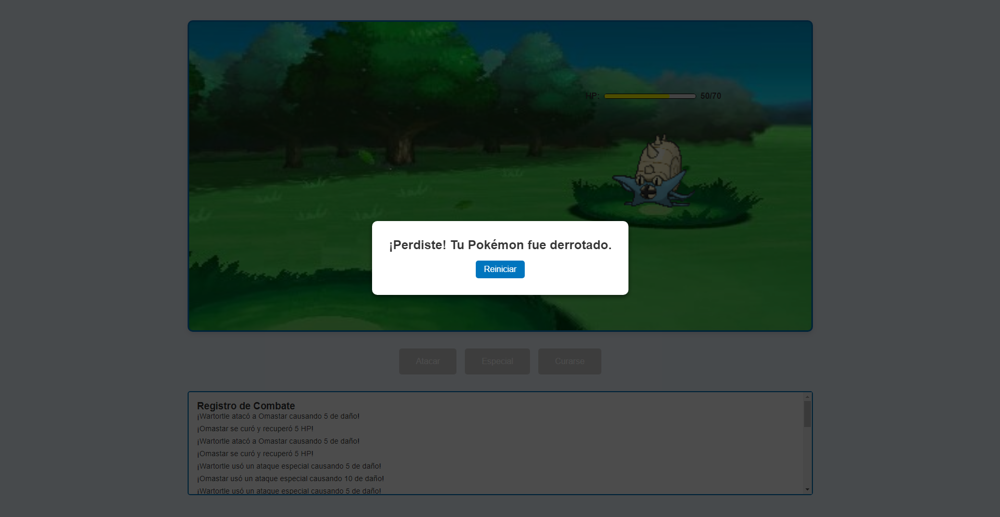
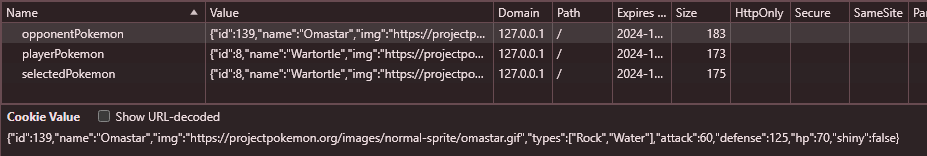

# Descripción del Proyecto

Este proyecto consiste en el desarrollo de una aplicación de simulación de batallas Pokémon en tres pantallas principales. La aplicación permitirá a los usuarios seleccionar sus Pokémon, ver una pantalla de presentación de enfrentamiento entre los dos Pokémon seleccionados, y llevar a cabo el combate entre ellos. A continuación, se detallan los requerimientos de cada pantalla:

## Pantalla 1: Selección de Pokémon

- **Objetivo:** Permitir al usuario seleccionar un Pokémon de una lista predefinida.

**Descripción Funcional:**

- Mostrar una lista de Pokémon disponibles con sus características básicas (nombre, tipo, nivel de poder).
- Permitir la selección de un Pokémon para el jugador y su oponente (selección automática o manual).
- Mostrar detalles del Pokémon seleccionado, incluyendo imagen, habilidades principales y estadísticas (ataque, defensa, velocidad, etc.).

**Requisitos Técnicos:**

- Implementación de botones y una interfaz amigable para la selección.
- Integración de una base de datos o JSON con la información de los Pokémon.

    <h3><b>Pokémon Selection - Stage 1</b></h3>
    

## Pantalla 2: Presentación VS

- **Objetivo:** Generar una presentación animada de los Pokémon seleccionados en un formato de "VS" (uno contra otro).

**Descripción Funcional:**

- Mostrar una transición visual con el mensaje "VS" entre los Pokémon seleccionados del jugador y del oponente.
- Incluir una breve animación para crear expectativa antes del combate, mostrando los nombres y tipos de cada Pokémon.
- Añadir efectos visuales o de sonido para realzar el momento.

**Requisitos Técnicos:**

- Uso de animaciones y transiciones.
- Posibilidad de agregar efectos de sonido y gráficos para mejorar la experiencia visual.

    <h3><b>Pokémon Selection - Stage 2</b></h3>
    

## Pantalla 3: Combate

- **Objetivo:** Simular la batalla entre los dos Pokémon seleccionados, permitiendo al jugador interactuar con los ataques y defensas.

**Descripción Funcional:**

- Mostrar las estadísticas actuales de cada Pokémon (HP, energía, etc.) y actualizar los cambios en tiempo real.
- Ofrecer opciones de ataque, defensa y movimientos especiales según el Pokémon seleccionado.
- Implementar una mecánica de combate por turnos, donde el jugador y el oponente se alternen para realizar acciones.
- Mostrar efectos visuales y animaciones de los ataques.
- Definir una lógica de combate que considere los tipos y habilidades de cada Pokémon.

**Requisitos Técnicos:**

- Implementación de lógica de combate por turnos.
- Actualización de la interfaz en tiempo real.
- Uso de animaciones para los ataques.

    <h3><b>Pokémon Combat - Stage 3</b></h3>
    

            
            
    

## Guardado de datos de los Pokemónes

    

## Objetivos del Proyecto

- Crear una experiencia de combate Pokémon atractiva y fluida que involucre a los jugadores.
- Desarrollar un sistema de batalla simple que permita entender fácilmente los puntos fuertes y débiles de cada Pokémon en el combate.
- Facilitar una interfaz visualmente atractiva que imite la experiencia de los juegos de Pokémon clásicos.

## Estructura del Proyecto

- **Pantallas Principales:** [Enlace Directo](./pages/)
    - `Stage1.html` ó Pantalla 1: Selección de Pokémon
    - `Stage2.html` ó Pantalla 2: Presentación VS
    - `Stage3.html` ó Pantalla 3: Combate

- **Archivos de la Lógica:** [Enlace Directo](./scripts/js/)
    - `Stage1.js`: Contiene la lógica de la pantalla 1 (selección de Pokémon).
    - `Stage2.js`: Contiene la lógica de la pantalla 2 (presentación VS).
    - `Stage3.js`: Contiene la lógica de la pantalla 3 (combate).

- **Archivos de Estilos:** [Enlace Directo](./styles/)
    - `Stage1.css`: Contiene los estilos de la pantalla 1 (selección de Pokémon).
    - `Stage2.css`: Contiene los estilos de la pantalla 2 (presentación VS).
    - `Stage3.css`: Contiene los estilos de la pantalla 3 (combate).

- **Archivos de Imágenes:** [Enlace Directo](./img/)
    - `BattleImage.jpg`: Imagen de fondo para la pantalla de combate.

- **Archivos de Sonidos:** [Enlace Directo](./sounds/)
    - `battle.mp3`: Audio de fondo para la pantalla de combate.
    - `vs.mp3`: Sonido de VS para la pantalla de presentación VS.

- **Archivos de Datos:** [Enlace Directo](./data/Pokemons.js)
    - `Pokemons.js`: Base de datos de Pokemon con información basica y estadísticas.